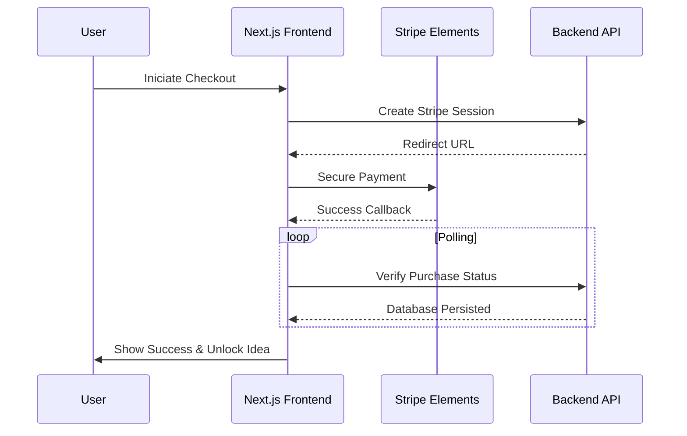

<p align="center">
  
</p>

<h1 align="center">EcoSpark Hub | Frontend</h1>

<p align="center">
  <strong>Ignite Sustainable Innovation. A performance-driven React 19 ecosystem.</strong>
</p>

<p align="center">
  <a href="https://nextjs.org/">
    
  </a>
  <a href="https://react.dev/">
    
  </a>
  <a href="https://tailwindcss.com/">
    
  </a>
  <a href="https://framer.com/motion/">
    
  </a>
</p>

---

## 🎨 UI/UX Preview

<p align="center">
  
</p>

---

## 🎨 Design Philosophy

EcoSpark Hub is built on the principle of **Atomic Design**, ensuring that every component is reusable, performant, and accessible. The frontend leverages **Next.js 16** and **React 19** to deliver a "blink-and-you-miss-it" experience, with kinetic animations powered by **Framer Motion**.

### Visual Excellence
*   **Tailwind CSS 4**: Utilizing the cutting-edge utility engine for zero-runtime CSS.
*   **Responsive Core**: A layout that gracefully transitions from desktop density to mobile simplicity.
*   **Intuitive UX**: Micro-interactions provide instant feedback for every user action.

---

## 🎯 Features

- **Authentication UI**: Sleek, validated forms for registration and login with real-time feedback.
- **Idea Listing & Filtering**: Advanced marketplace explorer with category-level filtering and search persistence.
- **Pagination**: Efficient server-side pagination for exploring thousands of blueprints without lag.
- **Voting System**: Interactive UP/DOWN vote interactions with instant UI updates (Optimistic UI).
- **Comment UI**: Structured, nested discussion threads for technical collaboration on ecological projects.
- **Payment Flow**: Integrated Stripe Checkout experience with real-time verification and content unlocking.
- **Dashboard UI**: Comprehensive analytics and management views for both Members and Administrators.
- **Responsive Design**: Mobile-first architecture ensuring a premium experience on any device size.

---

## 🛠️ Technologies Used

- **Next.js (App Router)**: Modern React framework for server-side rendering, efficient routing, and image optimization.
- **React**: The core component-based library for building dynamic and interactive user interfaces.
- **Tailwind CSS (v4)**: Utility-first CSS framework for rapid, consistent, and highly customizable styling with zero-runtime overhead.
- **Axios**: Robust promise-based HTTP client for making API requests to the backend server.
- **TanStack Query (React Query)**: Powerful state management library for fetching, caching, and synchronizing server data.
- **Framer Motion**: The industry-standard library for creating high-performance animations and gesture interactions.
- **React Hook Form**: High-performance, flexible form management with easy-to-use validation hooks.
- **Zod**: TypeScript-first schema declaration and validation library for ensuring input data integrity.
- **Stripe (@stripe/stripe-js)**: Secure client-side integration for processing global payments and checkout sessions.
- **Lucide React**: A collection of beautiful, pixel-perfect icons for intuitive visual communication.

---

## 🔗 API Integration

The EcoSpark Hub frontend is designed as a headless client that communicates with the centralized backend API via **Axios**.

- **Connection Hub**: Centralized API logic is located in `src/lib/api.ts`, where the Axios base URL and interceptors are configured.
- **Environment Variables**:
  - `NEXT_PUBLIC_API_URL`: The entry point for all backend requests (e.g., `http://localhost:5000/api`).
  - `NEXT_PUBLIC_STRIPE_PUBLISHABLE_KEY`: Used to initialize the Stripe Elements and handle secure client-side transactions.
- **Authentication**:
  - **JWT Tokens**: Handled securely via **HTTP-only cookies** provided by the backend, ensuring protection against XSS.
  - **Auth Context**: A global React Context (`src/contexts/AuthContext.tsx`) manages the user profile state and session persistence.

---

## 🏗️ Interactive Flow: Payment Success



---

## 📂 Project Architecture

```text
src/
 ├── app/             # App Router: Pages, Layouts, and API handling
 ├── components/      # Atomic UI system (Common, Layout, UI)
 ├── contexts/        # Shared state: Auth, Payment, and Theme
 ├── lib/             # Core utilities: Axios, API client, and Shorthands
 └── hooks/           # Specialized React hooks for data fetching
```

---

## 🚀 Deployment & Operations

### 1. Requirements
- Node.js 18.x / 20.x
- **[EcoSpark Backend](../backend)** must be active.

### 2. Quick Start
```bash
# Clone and enter
git clone https://github.com/your-repo/ecospark-hub.git
cd ecospark-hub/frontend

# Install and build
npm install
npm run build # For production check
npm run dev   # Standard local dev
```

### 3. Environment Configuration
Create `.env.local`:
```env
NEXT_PUBLIC_API_URL="http://localhost:5000/api"
NEXT_PUBLIC_STRIPE_PUBLISHABLE_KEY="pk_test_..."
```

---

## 👨‍💻 Engineering & Maintainers
**The EcoSpark Frontend Team**  
*Building the visual identity of a sustainable world.*

---

<p align="center">
  Released under the MIT License. &copy; 2026 EcoSpark Hub Platform.
</p>
