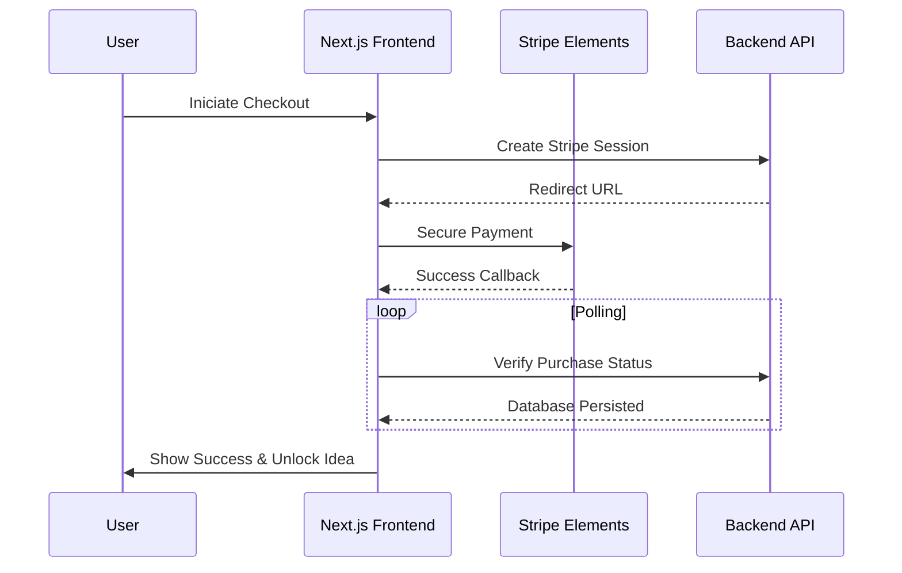

<p align="center">
  
</p>

<h1 align="center">EcoSpark Hub | Frontend</h1>

<p align="center">
  <strong>Ignite Sustainable Innovation. A performance-driven React 19 ecosystem.</strong>
</p>

<p align="center">
  <a href="https://nextjs.org/">
    
  </a>
  <a href="https://react.dev/">
    
  </a>
  <a href="https://tailwindcss.com/">
    
  </a>
  <a href="https://framer.com/motion/">
    
  </a>
</p>

---

## 🎨 Design Philosophy

EcoSpark Hub is built on the principle of **Atomic Design**, ensuring that every component is reusable, performant, and accessible. The frontend leverages **Next.js 16** and **React 19** to deliver a "blink-and-you-miss-it" experience, with kinetic animations powered by **Framer Motion**.

### Visual Excellence
*   **Tailwind CSS 4**: Utilizing the cutting-edge utility engine for zero-runtime CSS.
*   **Responsive Core**: A layout that gracefully transitions from desktop density to mobile simplicity.
*   **Intuitive UX**: Micro-interactions provide instant feedback for every user action.

---

## ✨ Key Features

### 🔐 Multi-Role Identity
*   **Role-Specific Navigation**: Dynamically adjusted sidebars for Members and Administrators.
*   **Secure Access**: Protected routes with client-side state persistence and JWT validation.
*   **Schema-Driven Forms**: Type-safe data entry via **Zod** and **React Hook Form**.

### 💼 Sustainability Marketplace
*   **Innovator Dashboard**: Project tracking, funding analytics, and draft management.
*   **Marketplace Explorer**: Advanced category-based filtering and instant search.
*   **Interaction Hub**: Integrated voting and nested comment systems for project discourse.

### 💳 Financial Ecosystem
*   **Stripe Elements**: Seamlessly integrated, secure checkout experiences.
*   **Polling Verification**: Real-time frontend synchronization with backend payment webhooks.
*   **Success Visualization**: Dynamic status updates and instant content unlocking.

---

## 🛠️ Technical Stack

| Category | Technology |
| :--- | :--- |
| **Framework** | Next.js 16 (App Router), React 19 |
| **State & Data** | TanStack Query (v5), Axios |
| **Styling** | Tailwind CSS 4, Lucide React, Framer Motion |
| **Forms** | React Hook Form, Zod |
| **Payments** | Stripe SDK (@stripe/stripe-js) |

---

## 🏗️ Interactive Flow: Payment Success



---

## 📂 Project Architecture

```text
src/
 ├── app/             # App Router: Pages, Layouts, and API handling
 ├── components/      # Atomic UI system (Common, Layout, UI)
 ├── contexts/        # Shared state: Auth, Payment, and Theme
 ├── lib/             # Core utilities: Axios, API client, and Shorthands
 └── hooks/           # Specialized React hooks for data fetching
```

---

## 🚀 Deployment & Operations

### 1. Requirements
- Node.js 18.x / 20.x
- **[EcoSpark Backend](../backend)** must be active.

### 2. Quick Start
```bash
# Clone and enter
git clone https://github.com/your-repo/ecospark-hub.git
cd ecospark-hub/frontend

# Install and build
npm install
npm run build # For production check
npm run dev   # Standard local dev
```

### 3. Environment Configuration
Create `.env.local`:
```env
NEXT_PUBLIC_API_URL="http://localhost:5000/api"
NEXT_PUBLIC_STRIPE_PUBLISHABLE_KEY="pk_test_..."
```

---

## 👨‍💻 Engineering & Maintainers
**The EcoSpark Frontend Team**  
*Building the visual identity of a sustainable world.*

---

<p align="center">
  Released under the MIT License. &copy; 2026 EcoSpark Hub Platform.
</p>
